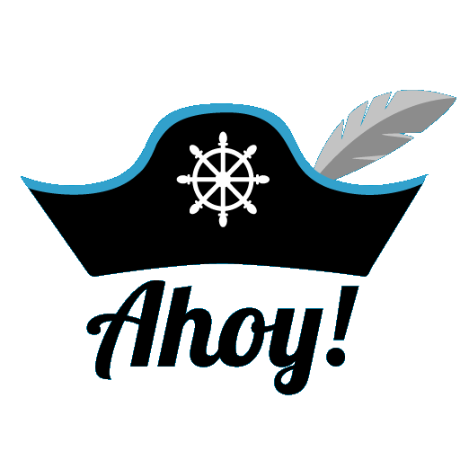
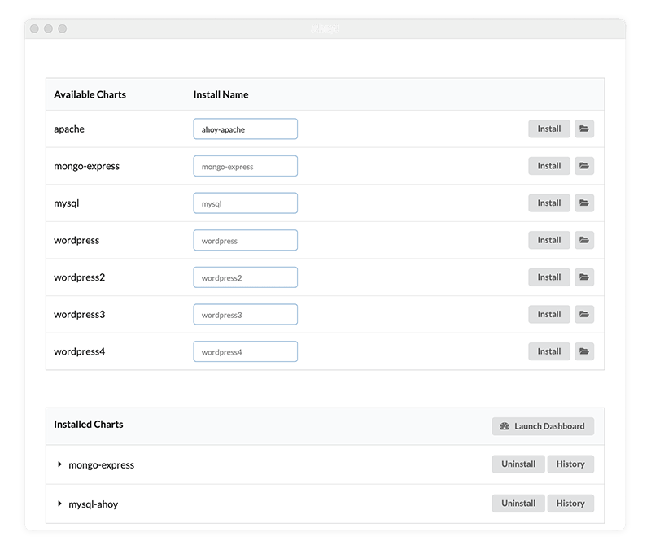
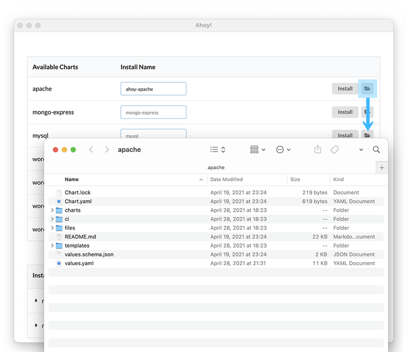
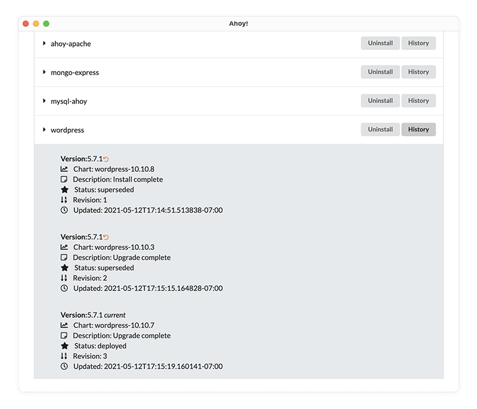
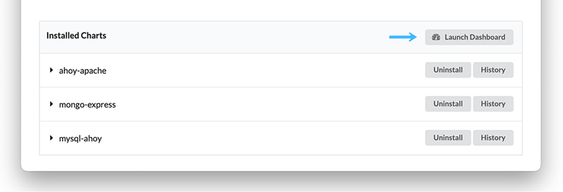

<!-- PROJECT LOGO -->
 

  

## Ahoy!

Ahoy! is a gui tool for DevOps engineers which distills the many functions of Helm into a user-friendly interface.
A GUI visually aids all engineers (even those that love CLI) and better organizes the various configuration files.
The ability to quickly revert to a previous version will give the DevOps engineer peace of mind.

## Built With

* [React](https://reactjs.org/), [Electron](https://www.electronjs.org/), [Semantic UI](https://semantic-ui.com/)

## Demo

  

## Features

### Install Chart

  

### Edit Chart

  

### Show History, Rollback

  

### Loaunch Minikube Dashboard

  

## Things You Need

- [Helm](https://helm.sh)
- [MiniKube](https://minikube.sigs.k8s.io/)
- [Docker](https://www.docker.com)
- Helm Charts. Bring your own or download from https://artifacthub.io.

## Team

   

       
        

          <h4><b>Joe Bigelow</b></h4>
          
            <a href="https://www.linkedin.com/in/joe-bigelow/" target ="_blank"> LinkedIn </a> | <a href="https://github.com/lilbigs2001" target ="_blank">GitHub</a>
          
        

  

   

       
        

          <h4><b>Tobey Forsman</b></h4>
          
            <a href="https://www.linkedin.com/in/tobeyforsman/" target ="_blank"> LinkedIn </a> | <a href="https://github.com/yebot" target ="_blank">GitHub</a>
          
        

  

   

       
        

          <h4><b>Jin Oh</b></h4>
          
            <a href="https://www.linkedin.com/in/yoko-kawamoto/" target ="_blank"> LinkedIn </a> | <a href="https://github.com/ohjintech" target ="_blank">GitHub</a>
          
        

  

   

       
        

          <h4><b>Yoko Kawamoto</b></h4>
          
            <a href="https://www.linkedin.com/in/jintoh613/" target ="_blank"> LinkedIn </a> | <a href="https://github.com/libero-yoko" target ="_blank">GitHub</a>
          
        

  

